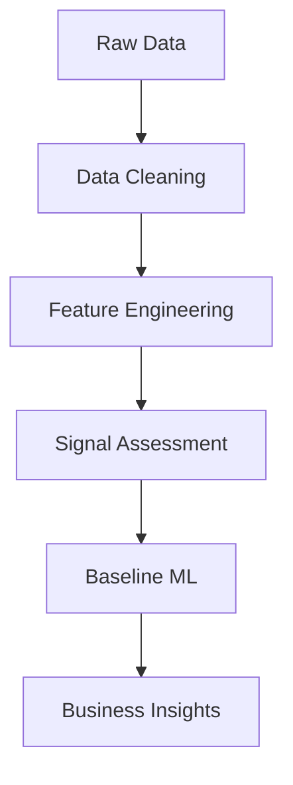
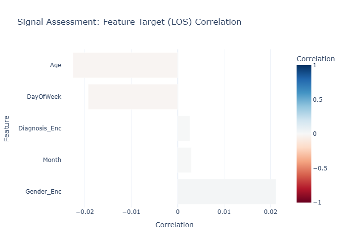
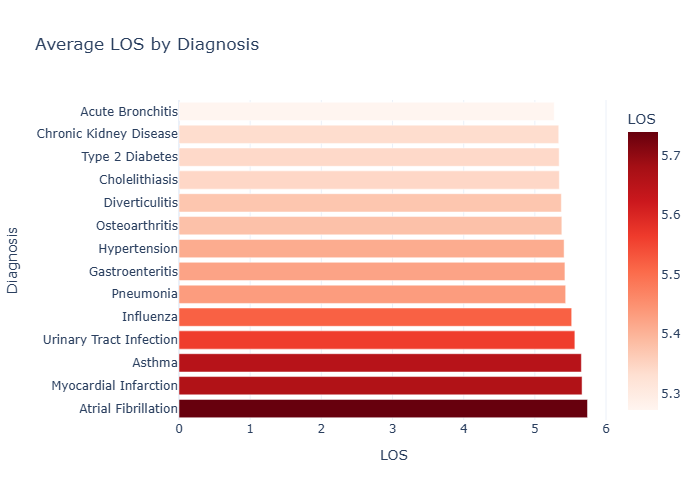
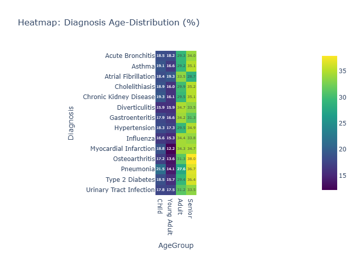
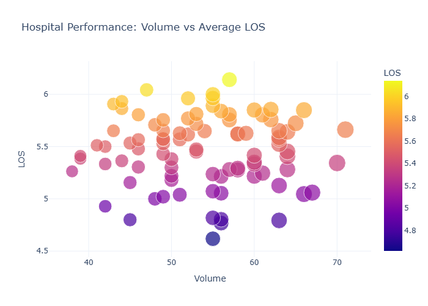

# 🏥 Hospital Length of Stay (LOS) Analytics & Data Quality Assessment


## 💡 Key Finding

> **Predictive performance remained poor (R² = -0.04), leading to a deeper investigation into data quality and feature-target relationships.**
>
> Further analysis revealed that Length of Stay (LOS) in this dataset has negligible correlation with available patient attributes, indicating limited predictive signal.
>
> This project demonstrates an important data science principle:
> **A sophisticated machine learning model cannot create predictive power when the underlying data contains little or no predictive signal.**

## 📑 Table of Contents

- [Project Overview](#-project-overview)
- [Problem Statement](#-problem-statement)
- [Dataset Overview](#-dataset-overview)
- [Project Workflow](#-project-workflow)
- [Data Cleaning Process](#-data-cleaning-process)
- [Feature Engineering](#-feature-engineering)
- [Data Quality & Signal Assessment](#-data-quality--signal-assessment)
- [Exploratory Data Analysis & Visualizations](#-exploratory-data-analysis--visualizations)
- [Machine Learning Pipeline](#-machine-learning-pipeline)
- [Model Evaluation & Results](#-model-evaluation--results)
- [Critical Data Science Insight](#-critical-data-science-insight)
- [Key Insights](#-key-insights)
- [Technologies Used](#-technologies-used)
- [Folder Structure](#-folder-structure)
- [Installation Guide](#-installation-guide)
- [Usage Instructions](#-usage-instructions)
- [Future Improvements](#-future-improvements)
- [Contributing](#-contributing)
- [License](#-license)
- [Author](#-author)

---

##  Project Overview



This project demonstrates a **complete healthcare data science pipeline**: data cleaning, feature engineering, signal assessment, machine learning, and interactive visualization applied to hospital patient records for Length of Stay (LOS) analysis.

This project demonstrates not only how to build machine learning models, but also how to determine when machine learning is inappropriate due to insufficient predictive signal.

A key outcome of this project is the critical finding that the dataset's LOS values are **synthetically generated** and carry no predictive signal. Rather than hiding this result, the notebook walks through the rigorous analytical process a Senior Data Scientist uses to detect and report such findings.

##  Problem Statement

Hospital resource management depends on accurately forecasting patient Length of Stay (LOS). This project builds an end-to-end pipeline to:

1. Clean and validate real-world hospital records.
2. Engineer domain-specific clinical features.
3. Assess whether the data contains predictive signal before modelling.
4. Train and evaluate an XGBoost baseline model.
5. Generate interactive dashboards for hospital performance analytics.

## Dataset Overview

| Property | Detail |
| --- | --- |
| **Source** | [Kaggle — Hospital Records for Data Cleaning (Medium)](https://www.kaggle.com/datasets/nudratabbas/hospital-records-for-data-cleaning-medium) |
| **File** | `hospital_patients_real_world.csv` |
| **Purpose** | Originally designed as a **data cleaning exercise** |
| **Key Columns** | PatientID, Age, Gender, Diagnosis, AdmissionDate, DischargeDate, HospitalID |

##  Project Workflow

The notebook is organized into **six clearly labelled phases**:

```
Phase 1 → Environment Setup & Library Imports
Phase 2 → Data Ingestion & Cleaning Pipeline (OOP)
Phase 3 → Feature Engineering
Phase 4 → Data Quality & Signal Assessment   ← Critical step
Phase 5 → Machine Learning Baseline (XGBoost)
Phase 6 → Professional Insights & Visualizations
```

##  Data Cleaning Process

Implemented inside the Object-Oriented `HospitalDataManager` class:

- Converted `AdmissionDate` and `DischargeDate` to proper datetime format.
- Derived the target variable `LOS` (Length of Stay in days).
- Filtered out erroneous negative LOS values (`LOS >= 0`).
- Imputed missing `Age` values with the column median.
- Removed duplicate patient records.
- Standardized `Diagnosis` text to Title Case for consistency.

##  Feature Engineering

Implemented via the `add_smart_features` function:

| Feature | Method | Purpose |
| --- | --- | --- |
| `DayOfWeek` | Extracted from `AdmissionDate` | Capture weekday admission patterns |
| `Month` | Extracted from `AdmissionDate` | Capture seasonal trends |
| `AgeGroup` | Binned into Child / Young Adult / Adult / Senior | Simplify age-based analysis |
| `StayCategory` | LOS > 7 → Long Stay, else Short Stay | Binary stay classification |
| `Diagnosis_Enc` | Label Encoded | Prepare categorical for ML |
| `Gender_Enc` | Label Encoded | Prepare categorical for ML |

##  Data Quality & Signal Assessment

**Before training any model**, a correlation analysis was performed to verify whether features carry predictive signal:

| Feature | Correlation with LOS |
| --- | --- |
| Age | -0.023 |
| Gender | +0.010 |
| Diagnosis | -0.005 |
| DayOfWeek | ~0.00 |
| Month | ~0.00 |

**Finding:** All correlations are effectively **zero**. The LOS distribution is near-uniform (1–10 days), confirming that `AdmissionDate` and `DischargeDate` were generated **independently** of clinical features. This is consistent with the dataset being designed for data cleaning exercises, not predictive modelling.



## 📈 Exploratory Data Analysis & Visualizations

Five interactive **Plotly** dashboards were generated:

1. **Average LOS by Diagnosis** — Horizontal bar chart with `Reds` color scale identifying conditions with the longest average stays (Atrial Fibrillation leads at ~5.74 days).
<p align="center"></p>

2. **Heatmap: Diagnosis vs Age Group** — Normalized crosstab showing how diagnoses are distributed across age groups using `Viridis` color scale.
<p align="center"></p>

3. **Hospital Performance: Volume vs Average LOS** — Bubble scatter plot mapping hospital patient volume against average LOS across 90 hospitals.
<p align="center"></p>

4. **Seasonal Diagnosis Distribution** — Stacked bar chart showing monthly admission trends across all 14 diagnoses.
5. **Key Drivers of Length of Stay** — Horizontal bar chart of XGBoost feature importances with `Greens` color scale.

##  Machine Learning Pipeline

| Component | Detail |
| --- | --- |
| **Algorithm** | XGBoost Regressor (`XGBRegressor`) |
| **Hyperparameters** | `n_estimators=200`, `learning_rate=0.05`, `max_depth=4` |
| **Features** | Age, Diagnosis (Encoded), Gender (Encoded), DayOfWeek, Month |
| **Target** | Length of Stay (LOS) in days |
| **Split** | 80% Train / 20% Test (`random_state=42`) |
| **Serialization** | Model + encoders saved as `.pkl` files via Joblib |

## 📉 Model Evaluation & Results

| Metric | Value |
| --- | --- |
| **Mean Absolute Error (MAE)** | 2.58 days |
| **R² Score** | -0.04 |

##  Critical Data Science Insight

The negative R² is **not a failure, it is the correct answer.**

A negative R² means the model performs worse than simply predicting the average LOS (~5.47 days) for every patient. This happened because:

| Diagnostic Check | Result | Implication |
| --- | --- | --- |
| Feature-Target Correlation | All features ≈ 0.00 | No linear or monotonic signal exists |
| LOS Distribution | Near-uniform (1–10 days) | Synthetically generated, not clinically realistic |
| Dataset Purpose | Kaggle "Data Cleaning" dataset | Designed for cleaning exercises, not prediction |

**Professional Takeaway:** A Senior Data Scientist's job is not just to build models it is to know when data lacks signal and to communicate that finding clearly. Blindly reporting a high MAE without this context would be a red flag in a professional setting.

## 💡 Key Insights

1. **Although Admission Day of Week received the highest feature importance score, all feature importances were relatively uniform, suggesting the model was fitting noise rather than meaningful clinical relationships.**
2. **Atrial Fibrillation** has the highest average LOS (~5.74 days), while **Acute Bronchitis** has the lowest (~5.27 days)  a clinically negligible difference of ~0.5 days.
3. **Senior** and **Adult** age groups dominate admissions across all diagnoses.

##  Technologies Used

| Category | Tools |
| --- | --- |
| **Language** | Python 3.12 |
| **Data Wrangling** | Pandas, NumPy |
| **Machine Learning** | Scikit-Learn, XGBoost |
| **Visualization** | Plotly Express |
| **Serialization** | Joblib |
| **Environment** | Jupyter Notebook, Kaggle |

## 📁 Folder Structure

```text
Hospital-LOS-Analytics/
│
├── data/                              # Raw dataset (git-ignored)
│   └── hospital_patients_real_world.csv
├── notebook/                          # Jupyter notebook
│   └── los-analysis-and-prediction.ipynb
├── models/                            # Saved models (git-ignored)
│   ├── hospital_model.pkl
│   ├── le_diag.pkl
│   └── le_gen.pkl
├── README.md                          # Project documentation
├── requirements.txt                   # Python dependencies
├── .gitignore                         # Git ignore rules
└── LICENSE                            # MIT License
```

## 💻 Installation Guide

```bash
# 1. Clone the repository
git clone https://github.com/SyedMuhammadMujtabaKhalid/Hospital-LOS-Analytics.git
cd Hospital-LOS-Analytics

# 2. Create a virtual environment (recommended)
python -m venv venv
source venv/bin/activate        # Linux/Mac
venv\Scripts\activate           # Windows

# 3. Install dependencies
pip install -r requirements.txt
```

##  Usage Instructions

```bash
# Launch the notebook
jupyter notebook notebook/los-analysis-and-prediction.ipynb
```

Run the cells sequentially to reproduce the full pipeline:
1. **Phase 1–3:** Data cleaning and feature engineering.
2. **Phase 4:** Signal assessment verify feature-target correlations.
3. **Phase 5:** XGBoost baseline model training and evaluation.
4. **Phase 6:** Interactive Plotly dashboards and business insights.

## Future Improvements

- **Real-World Dataset:** Apply this pipeline to a clinically-linked dataset (e.g., MIMIC-III) where LOS correlates with diagnoses, vitals, and lab results.
- **Signal Validation:** Validate whether clinically meaningful LOS predictors exist before model development.
- **Model Optimization:** Hyperparameter tuning via GridSearchCV / Optuna on a dataset with actual signal.
- **Additional Algorithms:** Benchmark Random Forest, LightGBM, and Ridge Regression.
- **Deployment:** Build a Streamlit dashboard for real-time LOS prediction and hospital analytics.
- **Feature Expansion:** Incorporate comorbidity indices, medication data, and prior admission history.

##  Contributing

Contributions, issues, and feature requests are welcome! Feel free to open an issue or submit a pull request.

##  License

This project is licensed under the [MIT License](LICENSE).

##  Author

**Syed Muhammad Mujtaba Khalid**

- GitHub: [@SyedMuhammadMujtabaKhalid](https://github.com/SyedMuhammadMujtabaKhalid)
